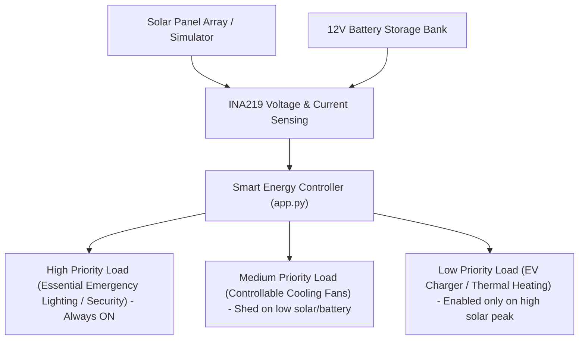

# EcoPower – Smart Renewable Energy Generation and Management System

**Smart India Hackathon 2026 (SIH 2026)**  
**Theme:** Renewable / Sustainable Energy  
**Category:** HARDWARE (AICTE Problem Statement)  
**Problem Statement ID:** SIH26217  
**Project Title:** EcoPower – Smart Renewable Energy Generation and Management System  

---

## Table of Contents
1. [Official Problem Statement](#1-official-problem-statement)
2. [Problem Analysis & Vision](#2-problem-analysis--vision)
3. [Proposed Solution](#3-proposed-solution)
4. [Smart Energy Management Engine](#4-smart-energy-management-engine)
5. [Hardware Components & Architecture](#5-hardware-components--architecture)
6. [Software Components](#6-software-components)
7. [System Block Diagram & Data Flow](#7-system-block-diagram--data-flow)
8. [Circuit Wiring & Pinout Mapping](#8-circuit-wiring--pinout-mapping)
9. [Mathematical Model & Formulas](#9-mathematical-model--formulas)
10. [API Endpoints Reference](#10-api-endpoints-reference)
11. [Hackathon Scenario Presets](#11-hackathon-scenario-presets)
12. [Innovation & SIH Evaluation Criteria](#12-innovation--sih-evaluation-criteria)
13. [Scalability & Real-World Applications](#13-scalability--real-world-applications)
14. [Environmental & Financial Impact](#14-environmental--financial-impact)
15. [Cost Estimation (BOM)](#15-cost-estimation-bom)
16. [Installation & How to Run](#16-installation--how-to-run)
17. [Hardware Setup & Flashing](#17-hardware-setup--flashing)
18. [Automated Testing & Verification](#18-automated-testing--verification)
19. [Hackathon Jury Demonstration Procedure](#19-hackathon-jury-demonstration-procedure)
20. [Project Verification & Summary](#20-project-verification--summary)

---

## 1. Official Problem Statement
* **Organisation:** AICTE (All India Council for Technical Education)
* **Category:** HARDWARE
* **Theme:** Renewable / Sustainable Energy
* **Problem Statement:** *"Student Innovation – Innovative ideas that help manage and generate renewable / sustainable sources more efficiently."*
* **Expected Outcome:** A complete, working, demonstrable hardware-prototype-ready and software-simulated renewable energy management system suitable for SIH 2026.

---

## 2. Problem Analysis & Vision
Solar PV microgrids suffer from solar output intermittency (cloud cover, day-night cycles) and static, unmanaged load draw. Standard installations either draw expensive grid power during solar drops or over-discharge battery banks, reducing battery lifespan and causing unexpected blackouts.

---

## 3. Proposed Solution
**EcoPower** introduces **Intelligent Priority-Based Energy Management**:
- Monitors real-time solar generation ($V, I, P$), battery state of charge (SoC), and microgrid loads.
- Automatically classifies loads by priority (High Essential, Medium Controllable, Low Non-Essential).
- Intelligently balances loads: preserves critical loads during low solar/battery events and auto-enables heavy appliances when renewable yield is high.
- Calculates monetary savings (₹), carbon reduction ($\text{kg CO}_2$), and renewable utilization percentage ($\%$).
- Offers full dual-mode support: Seamless transition between physical ESP32 IoT hardware node and software simulation mode.

---

## 4. Smart Energy Management Engine
The core innovation is **Priority-Based Automated Load Control**:


---

## 5. Hardware Components & Architecture
Safe low-voltage DC ($\le 12\text{V}$) hardware setup:
1. **NodeMCU ESP32 Dev Board:** WiFi connectivity, ADC sensing, 3-channel relay control.
2. **INA219 I2C Sensor:** $0-26\text{V}$ DC voltage and $\pm3.2\text{A}$ current sensing.
3. **12V Monocrystalline Solar Panel:** Clean DC generation source.
4. **12V LiFePO4 / Lead-Acid Battery Bank:** Microgrid backup storage.
5. **3-Channel Relay Module:** Optocoupler-isolated load switching.

---

## 6. Software Components
* **Backend:** Python 3.x, Flask REST API.
* **Frontend:** HTML5, CSS3 Glassmorphism UI, JavaScript (ES6), Chart.js.
* **Data Storage:** CSV logs (`data/energy_data.csv`) & JSON datasets (`data/sample_data.json`).
* **Testing:** Python `unittest` suite (`tests/test_app.py`).

---

## 7. System Block Diagram & Data Flow
```text
[Solar Panel & Battery] 
        ↓ (DC Sensors)
[ESP32 Microcontroller] 
        ↓ (HTTP POST /api/energy)
[Flask Backend app.py] ──> [Priority Load Controller]
        ↓                               ↓
[CSV Storage & Rules Engine]   [Relay Load Switching]
        ↓
[Web Dashboard http://127.0.0.1:5000]
```

---

## 8. Circuit Wiring & Pinout Mapping
- **GPIO 21 (SDA):** INA219 Sensor & OLED Display SDA
- **GPIO 22 (SCL):** INA219 Sensor & OLED Display SCL
- **GPIO 25:** Relay Channel 1 (High Priority Essential Load)
- **GPIO 26:** Relay Channel 2 (Medium Priority Cooling Load)
- **GPIO 27:** Relay Channel 3 (Low Priority Heavy Load)
- **GPIO 34 (ADC):** LDR Light Sensor

---

## 9. Mathematical Model & Formulas
1. **Power:**
   $$P (\text{Watts}) = V (\text{Volts}) \times I (\text{Amperes})$$
2. **Renewable Utilization Rate (%):**
   $$\text{Renewable Utilization (\%)} = \left( \frac{\text{Solar Energy Used}}{\text{Total Energy Consumed}} \right) \times 100$$
3. **Tariff Savings (₹):**
   $$\text{Money Saved (₹)} = \text{Solar Energy Used (kWh)} \times \text{Tariff Rate (₹/kWh)}$$
4. **Avoided Carbon Emissions:**
   $$\text{CO}_2 \text{ Reduction (kg)} = \text{Solar Energy Used (kWh)} \times 0.82 \text{ kg/kWh}$$

---

## 10. API Endpoints Reference
* `GET /` - Web Dashboard SPA
* `GET /about` - Project Brief & SIH Info Page
* `GET /hardware` - Hardware Specs & Wiring Guide Page
* `GET /api/status` - High-level system & connection status
* `GET /api/energy` - Real-time solar telemetry and yield metrics
* `GET /api/battery` - Battery percentage, voltage, and health status
* `GET /api/loads` - Priority load list with state (ON/OFF/AUTO)
* `POST /api/load-control` - Toggle specific load status or mode
* `POST /api/simulation` - Trigger hackathon preset scenarios
* `POST /api/energy` - Hardware telemetry ingest endpoint
* `GET /api/history` - Historical CSV telemetry logs

---

## 11. Hackathon Scenario Presets
One-click simulation buttons on the dashboard for instant demonstration:
- ☀️ **High Solar Generation:** Solar 22V, 2.5A, Battery 92% | All 3 loads enabled.
- 🌤️ **Normal Generation:** Solar 13.5V, 1.2A, Battery 75% | High & Medium loads active.
- ☁️ **Low Solar Generation:** Solar 8.0V, 0.4A, Battery 52% | Low load shed.
- 🪫 **Low Battery Emergency:** Solar 5.0V, 0.1A, Battery 18% | Essential load preserved only.
- ⚡ **High Load Demand:** Solar 14.0V, 1.8A, Battery 60% | Smart priority balancing.
- 🌿 **Energy Saving Mode:** Solar 12.5V, 1.0A, Battery 85% | Optimized eco-profile.

---

## 12. Innovation & SIH Evaluation Criteria
* **Novelty:** Priority-based automated load control integrated with real-time tariff & $\text{CO}_2$ tracking.
* **Technical Feasibility:** Low-cost, standard off-the-shelf ESP32 & INA219 modules.
* **Impact:** Prevents battery damage, reduces electricity bills, cuts carbon emissions.
* **Scalability:** Adaptable for homes, schools, remote solar water pumps, and microgrids.
* **Quality of Demonstration:** Interactive web dashboard with real-time charts, scenario presets, and manual controls.

---

## 13. Scalability & Real-World Applications
- **Homes & Commercial Buildings:** Automated load shifting to peak solar hours.
- **Microgrids & Off-Grid Villages:** Battery protection and essential load reservation.
- **Agricultural Solar Pumps:** Smart scheduling based on solar availability.

---

## 14. Environmental & Financial Impact
- Reduces fossil-fuel grid power consumption.
- Extends battery bank lifespan by preventing deep discharges.
- Provides immediate financial returns through tariff savings.

---

## 15. Cost Estimation (BOM)
- ESP32 Development Board: ₹350
- 12V 5W-10W Solar Panel: ₹450
- INA219 Power Sensor: ₹180
- 12V 7Ah Battery Pack: ₹650
- 3-Channel Relay Module: ₹140
- Demo DC Loads & Wires: ₹200
- **Total Prototype Cost:** **~₹1,970**

---

## 16. Installation & How to Run

### Step 1: Navigate to Project Folder
```cmd
cd C:\Users\Ram\.gemini\antigravity\scratch\EcoPower
```

### Step 2: Install Dependencies
```cmd
pip install -r requirements.txt
```

### Step 3: Launch Flask Backend
```cmd
python app.py
```

### Step 4: Open Browser
Navigate to:
[http://127.0.0.1:5000](http://127.0.0.1:5000)

---

## 17. Hardware Setup & Flashing
1. Open `hardware/controller_code/esp32_ecopower.ino` in Arduino IDE.
2. Select Board: **ESP32 Dev Module**.
3. Update WiFi credentials & Flask server IP.
4. Flash firmware and open Serial Monitor at **115200 baud**.

---

## 18. Automated Testing & Verification
To run the full unit and integration test suite:
```cmd
python -m unittest discover -s tests
```
*Expected Result:* 18 tests pass with `OK`.

---

## 19. Hackathon Jury Demonstration Procedure
1. Launch `python app.py` and open [http://127.0.0.1:5000](http://127.0.0.1:5000).
2. Show the **Live KPI Cards** ($V, I, P$, Battery %, Utilization %, Money Saved).
3. Demonstrate **Priority Load Shedding**:
   - Click ☀️ **High Solar Generation** -> All 3 loads turn ON.
   - Click ☁️ **Low Solar Generation** -> Low priority load switches OFF automatically.
   - Click 🪫 **Low Battery Emergency** -> Medium and Low loads switch OFF, Essential Emergency Load stays ON.
4. Show manual load toggles and mode auto buttons.
5. Highlight Chart.js analytics graphs and persistent CSV history logs.

---

## 20. Project Verification & Summary
- **Project Location:** `C:\Users\Ram\.gemini\antigravity\scratch\EcoPower`
- **Local Application URL:** `http://127.0.0.1:5000`
- **Tests Executed:** 18/18 Passed (`OK`)
- **Status:** Complete, working, demonstrable prototype for SIH 2026.
